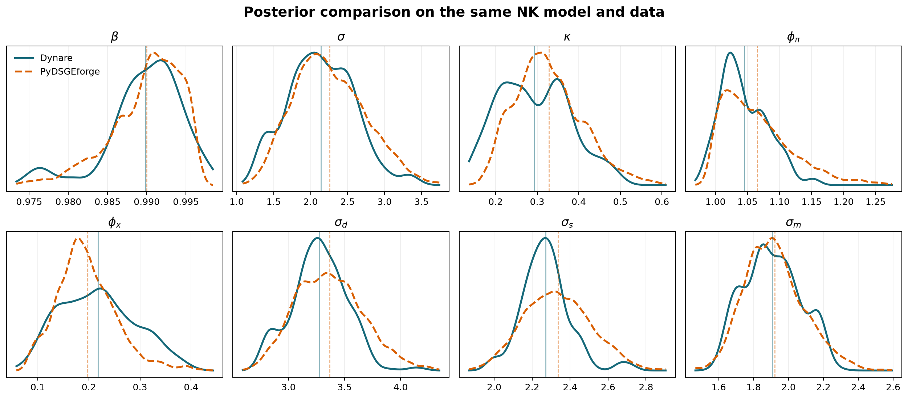
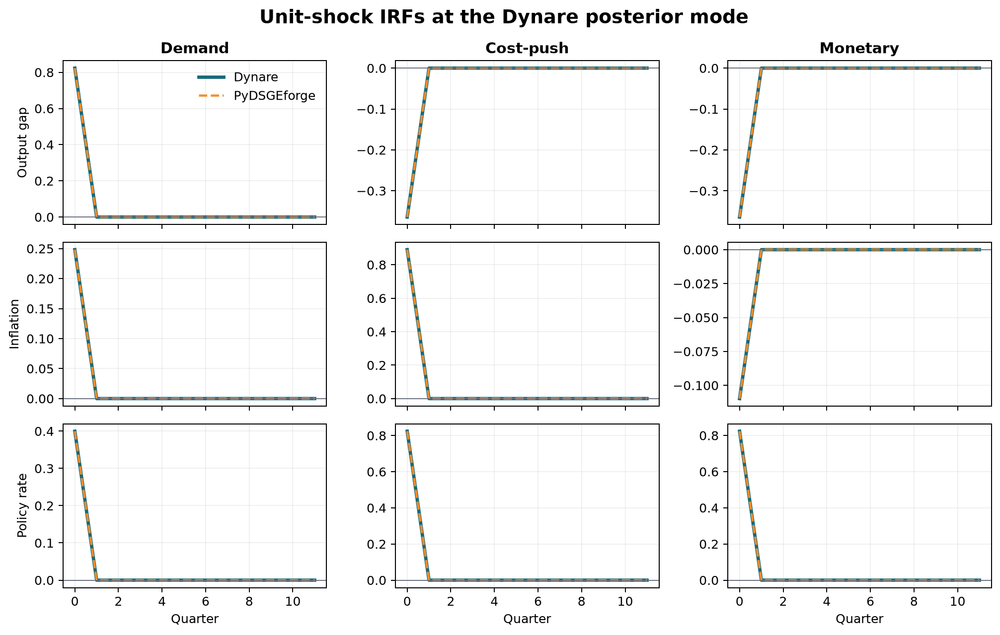
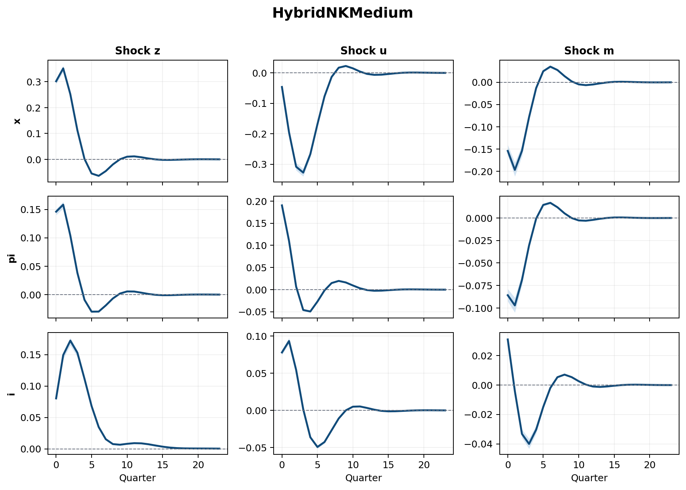
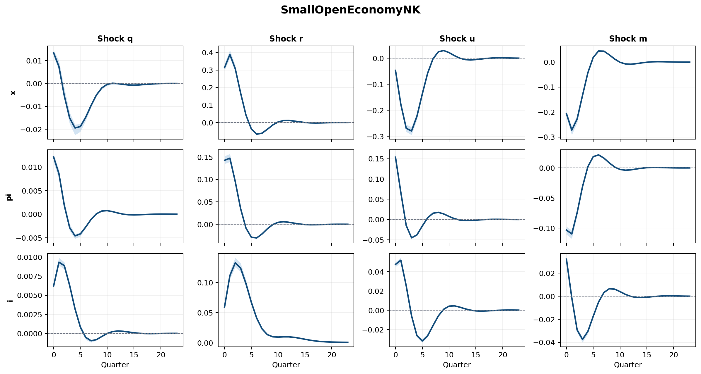

<div align="center">

# PyDSGEforge

**A general, YAML-first DSGE solver and Bayesian estimation toolkit implemented in Python.**

[](https://github.com/pablo-reyes8/PyDSGEforge/actions/workflows/ci.yml)
[](https://www.python.org/)
[](LICENSE)
[](CHANGELOG.md)
[](CITATION.cff)
[](Dockerfile)

Symbolic equations → linear rational-expectations solution → Kalman likelihood → MAP/MCMC → posterior IRFs.

</div>

## Index

- [Dynare parity](#dynare-parity)
- [Realistic DSGE showcases](#realistic-dsge-showcases)
- [Why PyDSGEforge](#why-pydsgeforge)
- [Installation](#installation)
- [Quick start](#quick-start)
- [YAML model specification](#yaml-model-specification)
- [Project structure](#project-structure)
- [Reproducibility and quality](#reproducibility-and-quality)
- [Contributing, security, and citation](#contributing-security-and-citation)
- [Roadmap](#roadmap)
- [References](#references)

## Dynare parity

The first benchmark is deliberately direct: the same three-equation New
Keynesian model, 82 observations, priors, posterior mode, prefiltering,
stationary Kalman initialization, and unit-shock convention are evaluated in
Dynare/Octave and PyDSGEforge.

| Numerical check | Dynare | PyDSGEforge | Absolute difference |
|---|---:|---:|---:|
| Log likelihood at Dynare mode | -555.4646535601 | -555.4646535592 | **9.14 × 10⁻¹⁰** |
| Log posterior at Dynare mode | -586.7712107416 | -586.7712107406 | **9.14 × 10⁻¹⁰** |
| Log posterior on 25 Dynare draws | — | — | **1.82 × 10⁻⁹ max** |
| Unit-shock IRFs | — | — | **7.77 × 10⁻¹⁶ max** |

The curves below compare 500 retained Dynare draws with 10,500 post-warmup
PyDSGEforge draws. Finite-chain KDEs need not overlap pixel-for-pixel; the
pointwise likelihood and posterior checks above establish numerical parity.

<p align="center">
  
</p>

<p align="center">
  
</p>

The compact, reviewable reference is in
[`dynare_comprobation/`](dynare_comprobation/README.md). It contains the `.mod`
file, readable CSV data, posterior mode, retained draws, metrics, and an
independent validator—not Dynare's generated matrices, bytecode, or plots.

```bash
python dynare_comprobation/validate.py
```

## Realistic DSGE showcases

Two larger YAML-only models demonstrate persistent states, forward and backward
dynamics, measurement error, MAP estimation, adaptive Metropolis-Hastings, and
posterior IRF bands.

| Model | Economic ingredients | Solved system | MCMC acceptance |
|---|---|---:|---:|
| [`HybridNKMedium`](configs/hybrid_nk_medium.yaml) | Habit, indexation, rate smoothing, three AR(1) shocks | 8 states, 3 shocks | 20.5% |
| [`SmallOpenEconomyNK`](configs/open_economy_nk.yaml) | Hybrid IS/Phillips blocks, exchange rate, natural rate, open-economy Taylor rule | 9 states, 4 shocks | 23.8% |

### Hybrid medium-scale NK

<p align="center">
  
</p>

### Small open-economy NK

<p align="center">
  
</p>

The synthetic datasets use fixed seeds and each model's solved state space.
Rebuild the CSVs, estimations, posterior draws, PNG/PDF figures, and metrics with:

```bash
python scripts/build_showcase.py
```

Machine-readable results live in
[`outputs/showcase_report.json`](outputs/showcase_report.json). Notebook-ready
cells for both models are in
[`notebooks/showcase_more_models.ipynb`](notebooks/showcase_more_models.ipynb).

## Why PyDSGEforge

- **General equations:** declare variables, leads, lags, shocks, measurement
  equations, and parameters instead of selecting a hard-coded macro model.
- **YAML-first experiments:** model structure, priors, bounds, data, solver,
  likelihood, MAP, MCMC, and IRF settings can live in one reviewable file.
- **Explicit numerical conventions:** parameter transformations, covariance
  construction, Kalman initialization, prefiltering, and shock scaling are
  configurable and documented.
- **Composable Python API:** use the high-level `DSGE` facade or the underlying
  builders, Gensys solver, inference, and analysis modules independently.
- **External validation:** numerical comparisons are stored as fixtures and
  executable checks rather than screenshots alone.

Current capabilities include symbolic linearization with SymPy, Blanchard-Kahn
checks, a Sims-style Gensys solution, Gaussian state-space likelihood, multiple
prior families and constrained transformations, MAP optimization, adaptive
Metropolis-Hastings, and posterior impulse-response summaries.

## Installation

Python 3.10 or newer is required.

```bash
git clone https://github.com/pablo-reyes8/PyDSGEforge.git
cd PyDSGEforge
python -m venv .venv
source .venv/bin/activate  # Windows: .venv\Scripts\activate
python -m pip install -e .
```

Development tools and optional Kalman-loop acceleration:

```bash
python -m pip install -e ".[dev]"
python -m pip install -e ".[speed]"
```

## Quick start

Validate a configuration without estimating it:

```bash
python scripts/run_pipeline.py --config configs/nk_full_yaml.yaml --dry-run
```

Run the configured estimation:

```bash
python scripts/run_pipeline.py --config configs/nk_full_yaml.yaml
```

Use the same model from Jupyter:

```python
from pathlib import Path

import pandas as pd
import yaml

from src.dsge import DSGE

config_path = Path("configs/hybrid_nk_medium.yaml")
cfg = yaml.safe_load(config_path.read_text(encoding="utf-8"))
model, registry, theta = DSGE.from_yaml(config_path)
data = pd.read_csv(cfg["data"]["path"])[cfg["data"]["columns"]].to_numpy()

result = model.compute(
    registry=registry,
    theta_struct=theta,
    data=data,
    compute_steady=False,
    div=cfg["solver"]["div"],
    map=cfg["map"]["enabled"],
    map_bounds="auto",
    map_kwargs={
        "method": cfg["map"]["method"],
        "hess_step": cfg["map"]["hess_step"],
        "tau_scale": cfg["map"]["tau_scale"],
        "hessian_strategy": cfg["map"]["hessian_strategy"],
        "include_jacobian_prior": cfg["map"]["include_jacobian_prior"],
    },
    run_mcmc=cfg["mcmc"]["enabled"],
    mcmc_draws=cfg["mcmc"]["draws"],
    mcmc_kwargs=cfg["mcmc"],
)
```

See [`docs/usage.md`](docs/usage.md) for the Python API and
[`docs/yaml_configuration.md`](docs/yaml_configuration.md) for the full schema.

## YAML model specification

A model is expressed as economic equations—not precomputed matrices:

```yaml
model:
  name: BasicNK
  variables:
    states: [x_t, pi_t, i_t]
    leads: [x_tp1, pi_tp1]
    shocks: [eps_d, eps_s, eps_m]
  equations:
    - "x_t = x_tp1 - (1 / sigma) * (i_t - pi_tp1) + eps_d"
    - "pi_t = beta * pi_tp1 + kappa * x_t + eps_s"
    - "i_t = phi_pi * pi_t + phi_x * x_t + eps_m"

parameters:
  specs:
    beta:
      transform: logistic
      bounds: {lower: 0.90, upper: 0.999}
      prior:
        family: beta
        params: {a: 391.05, b: 3.95, loc: 0.0, scale: 1.0}
  theta_econ:
    beta: 0.99

q:
  diag_params: [sig_d, sig_s, sig_m]
```

The complete benchmark is
[`configs/nk_full_yaml.yaml`](configs/nk_full_yaml.yaml); the smallest smoke
test is [`configs/tiny_ar1.yaml`](configs/tiny_ar1.yaml).

## Project structure

```text
PyDSGEforge/
├── src/                    # Library: builders, solver, inference, analysis
├── configs/                # Reusable YAML model specifications
├── tests/                  # Numerical and API regression tests
├── docs/                   # Usage, schema, conventions, and testing notes
├── scripts/                # CLI, showcase, and reference export utilities
├── dynare_comprobation/    # Minimal external parity fixture
├── data/                   # Example and fixed-seed synthetic datasets
├── outputs/                # Reproducible figures and machine-readable results
└── notebooks/              # Interactive demonstrations
```

The core path is:

```text
equations + parameter registry
        ↓
linear-system builder
        ↓
Gensys / Blanchard-Kahn solution
        ↓
state-space + Kalman likelihood
        ↓
MAP / MCMC
        ↓
posterior diagnostics + IRFs
```

Detailed module notes are available in [`docs/api.md`](docs/api.md) and
[`docs/numerical-conventions.md`](docs/numerical-conventions.md).

## Reproducibility and quality

The repository provides one-command development gates:

```bash
make help          # list commands
make test          # unit and regression tests
make dynare-check  # independent numerical parity check
make check         # lint + tests + parity + package build
make docker-test   # isolated container test stage
```

CI tests Python 3.10–3.12, validates a configured model, checks the Dynare
fixture, builds source/wheel distributions, installs the wheel, and executes the
Docker test stage. The runtime container is multi-stage and runs as a non-root
user.

## Contributing, security, and citation

- Read [`CONTRIBUTING.md`](CONTRIBUTING.md) before proposing code or numerical
  convention changes.
- Follow [`CODE_OF_CONDUCT.md`](CODE_OF_CONDUCT.md).
- Report vulnerabilities privately as described in [`SECURITY.md`](SECURITY.md).
- Cite research use with the machine-readable [`CITATION.cff`](CITATION.cff).
- Release notes are maintained in [`CHANGELOG.md`](CHANGELOG.md).

PyDSGEforge is released under the [MIT License](LICENSE).

## Roadmap

- Add more cross-implementation fixtures and period-by-period Kalman diagnostics.
- Extend nonlinear steady-state and higher-order approximation workflows.
- Stabilize the public API and publish versioned documentation and packages.
- Expand diagnostics for convergence, identification, and posterior predictive checks.

## References

- Sims, C. A. (2001). “Solving Linear Rational Expectations Models.”
  *Computational Economics*, 20, 1–20.
  [doi:10.1023/A:1013825826056](https://doi.org/10.1023/A:1013825826056).
- Jacobo, J. (2025). *Una introducción a los métodos de máxima entropía y de
  inferencia bayesiana en econometría*. Universidad Externado de Colombia.

## License

This project is licensed under the **MIT License** — you are free to use, modify, and distribute this code, provided that appropriate credit is given to the author.
